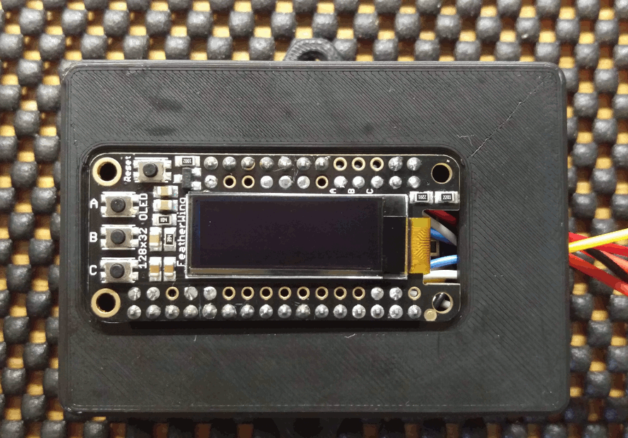
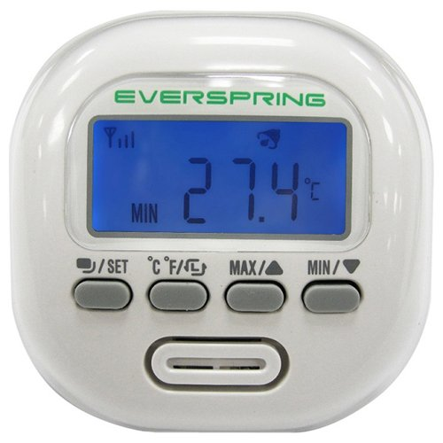
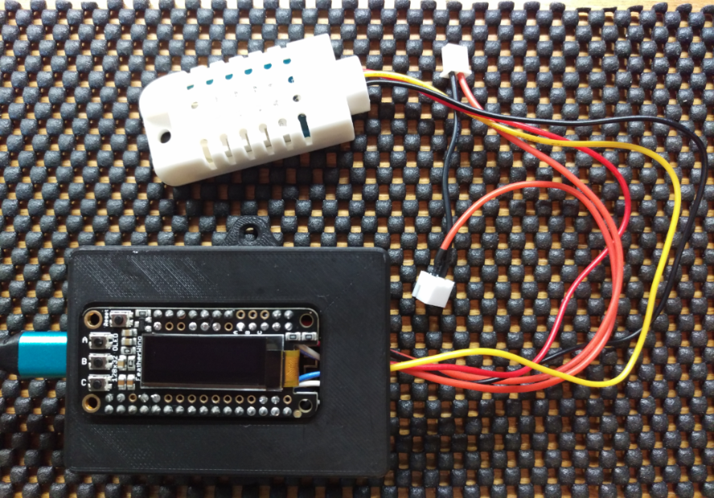

ESP8266 Adafruit Huzzah Monitor
-------------------------------
This is a firmware application written in C++ using
<a href="https://github.com/esp8266/Arduino">Arduino</a> and
<a href="https://github.com/adafruit/">Adafruit</a> libraries. It monitors
time, temperature, humidity, battery voltage, and current. Sensor readings are
posted to <a href="https://learn.adafruit.com/adafruit-io/overview#">
io.adafruit.com</a> using
<a href="https://learn.adafruit.com/adafruit-io/mqtt-api">MQTT</a>. Readings can
also be obtained on the Feather OLED (SSD1306) using the contact switches.




### Motivation

I own two <a href="http://a.co/4hNYmYY ">Everspring Z-Wave Wireless Temperature
and Humidity sensors</a>. Apparently they are no longer being made. At least I
couldn't find any for sale, so I decided to build something similar myself. The
Everspring provides temperature and humidity readings. It can post this data via
Z-Wave to a hub. Mine run for about a year on three lithium AAA batteries.

My replacement uses off-the-shelf bits I bought from the good folks at Adafruit
Industries. Like the Everspring my device has a
<a href="https://learn.adafruit.com/3d-printed-case-for-adafruit-feather">nice
plastic case</a>. The bottom compartment of that case holds a
<a href="https://www.adafruit.com/product/328">2500mAh Lithium Ion Polymer
Battery</a>. The battery is connected to an
<a href="https://www.adafruit.com/product/805">on/off switch</a> using a
<a href="https://www.adafruit.com/product/1131">cable</a> and a
<a href="https://www.adafruit.com/product/1769">connector</a>. That plugs into
the <a href="https://www.adafruit.com/product/2821">ESP8266 Huzzah</a> module
sitting in the middle part of the case. The temperature and humidity readings
are given by a <a href="https://www.adafruit.com/product/393">DHT22
(AM3202)</a> sensor. The current readings come from an
<a href="https://www.adafruit.com/product/904">INA219</a>. The display and push
buttons are the <a href="https://www.adafruit.com/product/2900">Feather
OLED</a>. I built my own voltage divider to provide the battery voltage. The
details of that are on the schematic:


All put together it looks like this:



The size of the DHT22 is a bit large but quite acceptable given its more
accurate than the smaller siblings in the same sensor family. The red and black
extension cord has the JST-HXP connectors used by my experiments. Its connected
to the inputs of the current sensor. The lid of the box is the top part of the
case. The blue cable on the left connects to a USB charger to top-up the
battery.

Building the Code
-----------------
I used the <a href="https://platformio.org">platformio</a> build system with
<a href="https://www.jetbrains.com/clion/">JetBrains CLion</a> to build this
project. If you plan to do so you'll need a platformio.ini file of your own. I
excluded mine from this repo because it contains all my secrets. I define
build_flags for secrets like my WiFi password and io.adafruit.com key. This
keeps them together and out of the source code for improved security and ease of
management. You can build you own using this template:

```
; PlatformIO Project Configuration File
;
;   Build options: build flags, source filter
;   Upload options: custom upload port, speed and extra flags
;   Library options: dependencies, extra library storages
;   Advanced options: extra scripting
;
; Please visit documentation for the other options and examples
; http://docs.platformio.org/page/projectconf.html
[platformio]
; MacOS X / Linux
lib_extra_dirs = ${env.HOME}/Documents/Arduino/libraries

[common]
lib_deps_external =
    https://github.com/adafruit/Adafruit-GFX-Library/archive/master.zip
    https://github.com/adafruit/Adafruit_FeatherOLED/archive/master.zip
    https://github.com/adafruit/Adafruit_SSD1306/archive/master.zip
    https://github.com/adafruit/Adafruit_Sensor/archive/master.zip
    https://github.com/adafruit/DHT-sensor-library/archive/master.zip
    https://github.com/adafruit/Adafruit_INA219/archive/master.zip

[env:huzzah]
platform = espressif8266
framework = arduino
board = huzzah
upload_port = /full/path/to/your/USB-TTL-DEVICE
upload_speed = 115200
lib_deps =
    ${common.lib_deps_external}
build_flags =
    '-DGMT_OFFSET=-5'
    '-DWIFI_SSID="WiFi_AP_SSID"'
    '-DWIFI_PASS="WiFi Password"'
    '-DWIFI_MAC_ADDR={0xE0, 0x9A, 0x4C, 0xB5, 0x5F, 0xC7}'
    '-DAIO_USERNAME="adafruit_user_name"'
    '-DAIO_KEY="dafruit_user_key"'
    '-DAIO_SERVER="io.adafruit.com"'
    '-DAIO_SERVERPORT=8883'
    '-DAIO_FLOAT_PRECISION=2'
    '-DAIO_GROUP_KEY="monitor-one"'
    '-DAIO_MQTT_PAYLOAD_FLOAT_MAX_SIZE=6'
```
You may want to redefine the following:
* GMT_OFFSET — The number of hours (or fraction thereof) your timezone is offset
from UTC/GMT.
* WIFI_SSID — Your WiFi access point's Service Set Identifier (SSID) or name.
* WIFI_PASS — Your WiFi access point's password.
* WIFI_MAC_ADDR — The six digit ethernet address of your ESP8266. I assign it so
that it will matchup with my DHCP server's configuration. I assign it a fixed IP
based upon it's Medium Access Controller (MAC) address.
* AIO_USERNAME — Your Adafruit IO username.
* AIO_KEY — Your Adafruit IO key (click the AIO Key button on a dashboard to
  find the key).
* AIO_SERVERPORT — The AIO server port. 8883 is correct for SSL clients.
* AIO_FLOAT_PRECISION — The number of decimal places to send to your feeds. The
API only sends strings. This number determines how many decimal places are kept
when floats are converted to strings for sending.
* AIO_GROUP_KEY — If your feeds are grouped, put the group name here.
* AIO_MQTT_PAYLOAD_FLOAT_MAX_SIZE — The API supports up to 29. Save memory by
defining a lower value if you can.

Application Notes
-----------------
I hope these notes will help to explain some software design and implementation
details which might not otherwise be immediately apparent.

### Time of Day
This application uses Network Time Protocol (NTP) to set the clock. Since the
ESP8266 has no persistent clock, the time must be set upon booting or waking the
system. I couldn't find a
<a href="https://en.wikipedia.org/wiki/Locale_(computer_software)">locale</a>
library to handle timezones and
<a href="https://en.wikipedia.org/wiki/Daylight_saving_time">Daylight Saving
Time</a> (DST) for this project so I wrote my own. It only works for the Eastern
timezone. You can modify it for your own locale by updating the DST start and
end dates in the `ntp_time_utils::dst_dates` map. Also change the timezone
abbreviation in `ntp_time_utils::set_dst_usa`.

### Battery voltage
The voltage is read by `get_battery_vdc()` in `monitor_read_battery.cpp`. This
function reads the ADC pin 30 times in one second and averages the results
together. The readings fluctuate based upon WiFi activity. Polling averages away
those fluctuations.

### MAC Address
There doesn't seem to be a library function for setting the MAC address in
either the `ESP8266WiFiSTAClass` or `ESP` classes so I wrote my own. See
`wifi_sta_set_mac()` in `ESP8266WiFiSTA_MAC.hpp`. This is a simple wrapper for
the NonOS SDK `wifi_set_macaddr()`. Note that I've assumed the station is in
Access Point mode; `#define STATION_IF 0x00`.

### SSL Certificate Validation
Some tutorials have suggested that fingerprint validation be used to verify
connections to SSL servers. I wasn't comfortable with this so I implemented
certificate validation by adding the DigiCert Global Root G2 used by
io.adafruit.com into `ADAFRUIT_IO_MQTT.hpp`. See `caCert[]` in that file.

### Feeding the Watchdog Timers
When the monitor's display is activated, by pressing reset and then "A" within 3
seconds, the loop permits the user to see 3 different pages of output by
pressing the "B" button sequentially. (Pressing "C" selects between Fahrenheit
and Celsius.) Pressing "A" again sends the device into sleep mode. This
interaction amounts to a long time for the loop to run. By contrast when
the display is off the loop only runs for about one second and then the device
goes back to sleep.

I found that the length of time the display mode can operate is limited by the
system's hardware watchdog timer. After maximizing timer resets I was still
unable to get the hardware timer to let the loop run more than five times in
display mode. Consequently this limit is enshrined in a macro:
`#define WDT_LOOP_LIMIT 5`.

You may be interested to know that the ESP8266 has two watchdog timers; one in
software and another in hardware. According to
<a href="http://neilkolban.com/tech/esp8266/">Neil Kolban's most excellent
book:</a>
```
The ESP8266 is a single threaded processor. This means it can only do one thing
at a time as there are no parallel threads that can be executed concurrently
with each other. An implication of this is that when the OS gives control to
your application, it doesn't get control back until such time as you explicitly
relinquish it. However, this can cause problems. The ESP8266 is primarily a WiFi
and TCP/IP device that expects to be able to receive and transmit data as well
as respond to asynchronous events within a timely manner. As an example, if your
ESP8266 device is connected to an access point and the access point wants to
validate that you are still connected, it may transmit a packet to you and
expect a response. You have no control over when that will happen. If your own
application program has control over the execution at the time when the request
arrives, that request will not be responded to until after you return control
back to the OS. Meanwhile, the access point may be expecting a response within
some predetermined time period and, if does not receive a reply within that
interval, may assume that you have disconnected. To prevent such circumstances
your application code has to return control back to the OS in a timely manner.
It is recommended that your code return control within 50 milliseconds of
gaining control. If you take longer, you run the risk of requests to your device
timing out.

If your own code fails to return control back to the OS, the OS must assume that
things are going wrong. As such, it has a timer that we call the "watchdog".
When control is given to your own code, the watchdog timer starts ticking. If
you have not returned control back to the OS by the time the watchdog timer
reaches zero, it takes matters into its own hands. Explicitly what it does is
reboot the device. This may sound like a pretty drastic action but the thinking
is that it is better to do this and hope that whatever was blocked is now
unblocked than just sit there "dead".
```
The ESP8266 Non-OS SDK API Reference, Version 2.1.2 says:

```
...the non-OS SDK does not preempt tasks or switch context. Users are
responsible for the proper execution of code and the user code must not occupy
the CPU on a particular function for too long. This may cause a watchdog reset
and prompt ESP8266 to reboot.

If for some reason the user application must execute a task for too long (say,
longer than 500 ms), it is recommended that the system_soft_wdt_feed() API be
called often to reset the WDT. Disabling the softWDT is not recommended.
```
The software watchdog can be turned off by calling `ESP.wdtDisable()` which in
turn calls the Non-OS SDK `system_soft_wdt_stop()`. Espressif warn that "The
software watchdog must not be stopped for too long (over 6 seconds), otherwise
it will trigger hardware watchdog reset." Another problem is that the watchdog
timers can not be reset by `system_soft_wdt_feed()` as called by `ESP.wdtFeed()`
and `Arduino.delay()` while the software timer is stopped.

Given all that, I decided not to disable the software watchdog and to maximize a
strategy of feeding the watchdog (resetting its timers) using `ESP.wdtFeed()`
and `Arduino.delay()`.

Bugs, Issues and Pull Requests
------------------------------
If you find a bug please create an issue. If you'd like to contribute please
send a pull request.

Project Status
--------------
This project has been archived and is no longer being maintained by the author.
